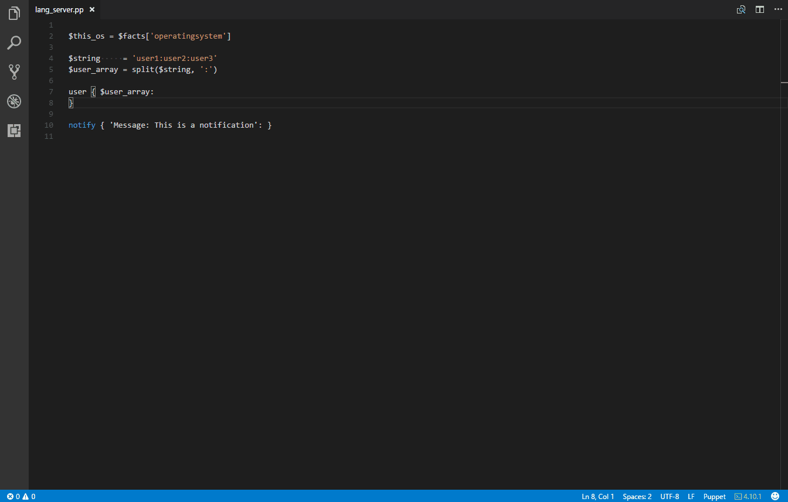

<!--
TODO: Need correct marketplace ID

-->

# Puppet Language Support for Visual Studio Code

This extension provides Puppet Language support for [Visual Studio Code](https://code.visualstudio.com/)

## Platform support

- Microsoft Windows
- MacOSX

## Features

- [Syntax highlighting](#Syntax_Highlighting)
- [Code snippets](#Code_snippets)
- IntelliSense for resources, parameters and more
- Import from `puppet resource` directly into manifests
- Node graph preview

## Requirements

- Puppet Agent

[Windows](https://docs.puppet.com/puppet/4.10/install_windows.html)

[MacOSX](https://docs.puppet.com/puppet/4.10/install_osx.html)

[Linux](https://docs.puppet.com/puppet/4.10/install_linux.html)

## Feature information

### Syntax Highlighting

Syntax highlighting uses [puppet-lint](https://github.com/rodjek/puppet-lint) and displays the results as you type, within VSCode.

- Puppet DSL
- Puppet Grammar

### Code Snippets

As part of IntelliSense and Snippets, you can quickly create blocks of code

### Puppet Resource

You can import existing resources directly using `puppet resource`

1. Open the command palette (`Ctrl+Shift+P`)

2. Type `puppet resource` and press enter

3. Enter the resource type you want to import, for example `user`

### Node Graph preview

You can preview the [node graph](https://puppet.com/blog/visualize-your-infrastructure-models) of a manifest while you edit your Puppet Code.

1. Open the command palette (`Ctrl+Shift+P`)

2. Type `puppet open node`.. and press enter

The node graph will appear next to the manifest

## Extension Settings

Coming!

<!-- TODO -->

## Known Issues

None yet.

## Release Notes

**Note** Not released yet. Work in Progress

### 0.0.3

Puppet Parser validate linter added

### 0.0.2

Puppet Resource and Puppet Module commands.

### 0.0.1

Initial release of the puppet extension.

